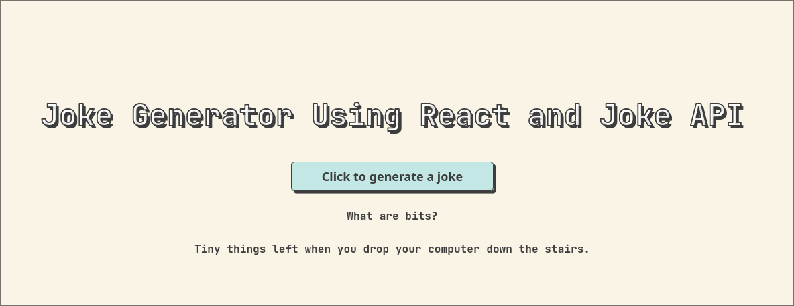

# React + Vite

this is a mini practice project to consume an API ( jokeAPI ) that allows me to generate jokes related to programming in a random way going over some basic concepts in react and allowing to interact with the page having a fun time.

